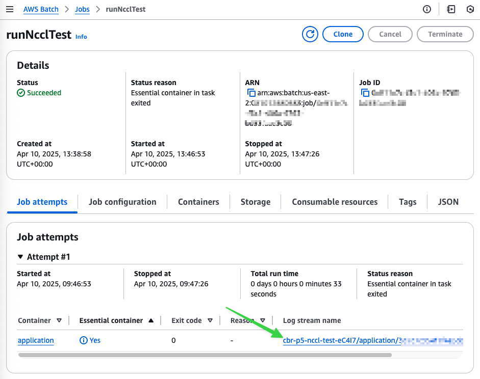

# Capacity Block for ML with AWS Batch example 

This example will show you how to deploy a fully functional AWS Batch environment that scales resources within a capacity block reservation. This example includes a job definition for a NCCL over Elastic Fabric Adapter test across 2 GPU instances.

## Step 1. Reserve a capacity block

In order to deploy the resources and run the example, you need to have a Capacity Block for ML reservation.  We can use the AWS CLI to search for available CBRs. The following example queries for the earlies possible capacity block that consists of a single `p4d.24xlarge` instances for `24` hours in duration. You will get up to three results, as per the ["Find and purchase Capacity Blocks" documentation](https://docs.aws.amazon.com/AWSEC2/latest/UserGuide/capacity-blocks-purchase.html).

```bash
aws ec2 describe-capacity-block-offerings \
  --instance-type p4d.24xlarge \
  --instance-count 1 \
  --capacity-duration 24 \
  --query "CapacityBlockOfferings[].{ \
              CapacityBlockOfferingId: CapacityBlockOfferingId, \
              AvailabilityZone: AvailabilityZone, \
              StartDate: StartDate, \
              CapacityBlockDurationHours:CapacityBlockDurationHours, \
              UpfrontFee: UpfrontFee }"
```

The output should look something like the following:

```json
[
    {
        "CapacityBlockOfferingId": "cb-0bfad2f7fb1b4478a",
        "AvailabilityZone": "us-east-2a",
        "StartDate": "2025-02-15T11:30:00+00:00",
        "CapacityBlockDurationHours": 24,
        "UpfrontFee": "283"
    },
    {
        "CapacityBlockOfferingId": "cb-0cfb51b701f835f96",
        "AvailabilityZone": "us-east-2a",
        "StartDate": "2025-02-14T16:13:00+00:00",
        "CapacityBlockDurationHours": 19,
        "UpfrontFee": "228"
    },
    {
        "CapacityBlockOfferingId": "cb-0c1fa9b2125eb49e0",
        "AvailabilityZone": "us-east-2a",
        "StartDate": "2025-02-14T16:13:00+00:00",
        "CapacityBlockDurationHours": 43,
        "UpfrontFee": "511"
    }
]
```
**To purchase an available Capacity Blocks for ML reservation:**

To purchase  one of the available capacity blocks, substitute your desired `CapacityBlockOfferingId` for `<CBR_ID>` in the following command:

> [!WARNING]
> Capacity block reservations will incur immediate and non-refundable costs!
> 
>  Before you commit to deploying this example, understand your commitments as outline in [Capacity Blocks pricing and billing](https://docs.aws.amazon.com/AWSEC2/latest/UserGuide/capacity-blocks-pricing-billing.html)
>
> As an example, given the above available reservations IDs, if you chose `CapacityBlockOfferingId`  `"cb-0bfad2f7fb1b4478a"` for `<CBR_ID>` in the following command, it would have immediately resulted in a non-refundable charge of **$283 USD** to your AWS account.
>
> Proceed with caution!


```bash
aws ec2 purchase-capacity-block \
    --capacity-block-offering-id "<CBR_ID>" \
    --instance-platform "Linux/UNIX" 
```

Once you confirmed that your reservation was successful, note the values for `CapacityReservationId` and the `AvailabilityZone` of the capacity block reservation for use in the next step. 

## Step 2. Deploying the infrastructure

**To deploy the AWS Batch environment using Terraform:**

1. Ensure that you have a working AWS account with administrative privileges. Also you will need to have [Terraform](https://developer.hashicorp.com/terraform/) and [Git](https://git-scm.com/) installed.
2. In your terminal, clone this repository and change to the `terraform` directory.
   ```bash
   git clone REPO
   cd REPO/terraform
   ```
3. Initialize the terraform stack.
   ```bash
   terraform init
   ```
4. Copy the `terraform.tfvars.example` file to `terraform.tfvars` and edit in the correct values for:
   1. (OPTIONAL) An AWS credentials profile, if you do not want to use your default profile.
   2. The AWS Region that corresponds to the CBR.
   3. A VPC ID within that AWS Region.
   4. A Subnet ID within the VPC that is in the same Availablity Zone as the CBR.
   5. The CBR ID.
5. Deploy the resources using the Terraform CLI.
   ```bash
   terraform apply
   ```
   The output should end with something like the following:
   ```bash
   Apply complete! Resources: 0 added, 4 changed, 0 destroyed.

   Outputs:

   run-job-cmd = <<EOT
   JOB_ID=$(aws --profile yw --region us-east-2 batch submit-job --job-queue arn:aws:batch:us-east-2:01234567890:job-queue/cbrJQ-eC4I7 --job-definition cbr-p5-nccl-test-eC4I7 --job-name runNcclTest --query jobId --output text)
   echo $JOB_ID
   EOT
   ```

## Step 3. Submitting the example job

The stack outputs include an AWS CLI command you can use to launch the example job definition. If you missed this output, you can see if again with the following command in your terminal:

```bash
terraform output
```

To submit the example job, simply copy and paste the provided command into your terminal. From the output example in the previous step, that would be the following two lines:

```bash
JOB_ID=$(aws --profile yw --region us-east-2 batch submit-job --job-queue arn:aws:batch:us-east-2:01234567890:job-queue/cbrJQ-eC4I7 --job-definition cbr-p5-nccl-test-eC4I7 --job-name runNcclTest --query jobId --output text)
echo $JOB_ID
```

This will output the job ID: `55feb744-a7b2-49eb-acac-47748dcb2403`

## Step 4. Checking results

The submitted job will not run until you the CBR is active and Batch launches one of your instances. At any point past the capacity reservations start time, you check the status of your job using the following command:

```bash
aws batch describe-jobs --jobs $JOB_ID --query "jobs[].{jobId: jobId, jobName: jobName, status: status}"
```

If you do not have the job ID saved in `$JOB_ID`, then you can search for the job using the [AWS Batch management console](https://console.aws.amazon.com/batch/home?#jobs/advanced-search).


Click on the **runNcclTest** link to show the job details. 



Once the results are completes with a **Status** of "Succeeded", check the results of the job log for the application container.


## Step 5. Cleaning up

Once you have confirmed that the example job ran, you can remove any created infrastructure with the following command.

```bash
terraform destroy
```

If your AWS Batch CloudWatch Logs [log group](https://console.aws.amazon.com/cloudwatch/home?#logsV2:log-groups/log-group/$252Faws$252Fbatch$252Fjob) has the retention period set to **Never expire**, you will also need to delete the CloudWatch Logs log stream(s) related to the job(s) that ran to avoid ongoing storage charges.